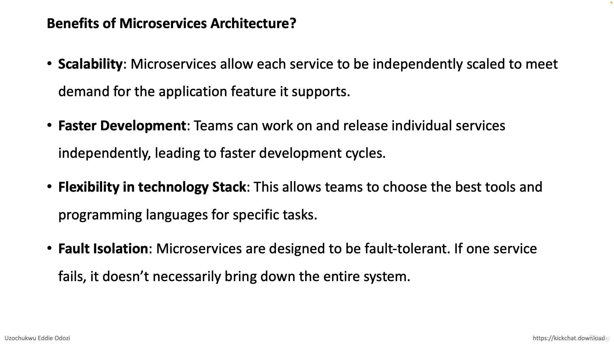
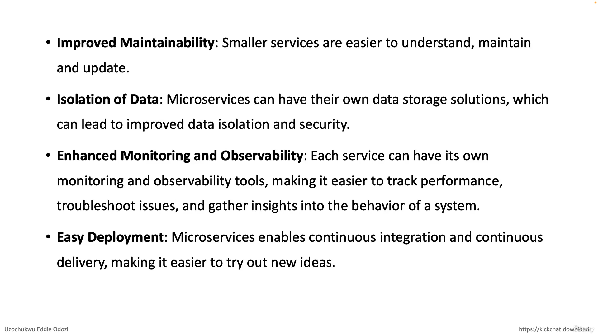
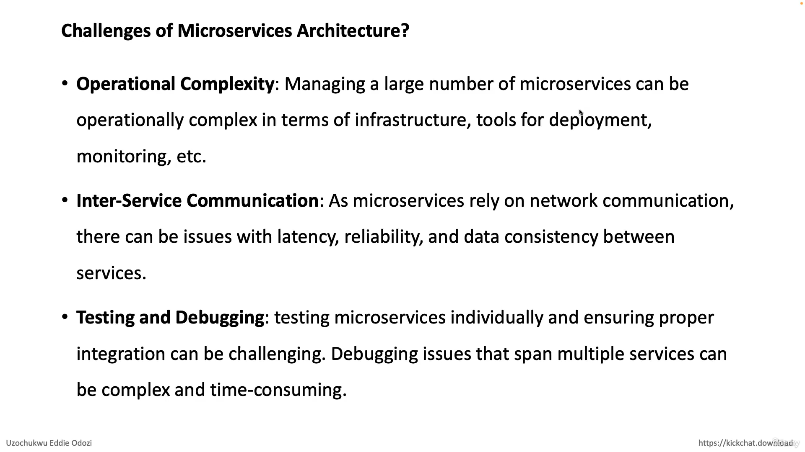
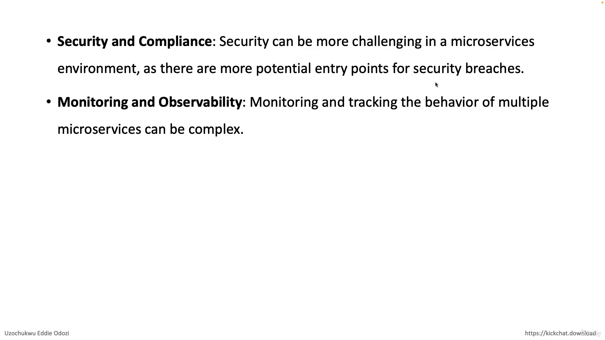

# What is microservice Architecture ?

### Microservice architecture is an architectural style that structures an application as a collection of small, loosely coupled, and independently deployable services. Each service is focused on performing a specific business function and can communicate with other services through well-defined APIs (Application Programming Interfaces).

1. **Decomposition**: The application is broken down into multiple services, each responsible for a specific task or function. This decomposition is typically based on business capabilities.

2. **Independence**: Each service is developed, deployed, and managed independently. This allows teams to work on different services simultaneously without interfering with each other.

3. **Loose coupling**: Services are designed to be loosely coupled, meaning they can operate independently of one another. Changes made to one service should not directly impact others.

4. **Scalability**: Microservices can be independently scaled based on demand. This allows for more efficient resource utilization compared to scaling the entire application.

5. **Resilience**: Failure in one service should not bring down the entire system. Microservices are designed to be resilient, with fault isolation mechanisms in place to contain issues within a single service.

6. **Technology diversity**: Each service can be implemented using different technologies, languages, and frameworks, based on what is most suitable for its specific requirements.

7. **Continuous deployment**: Microservices facilitate continuous integration and continuous deployment (CI/CD) practices, allowing for rapid and frequent updates to individual services without affecting the entire application.

# Microservices-Architecture-benefits

 

 

# Challenges of Microservices Architecture

 

  

