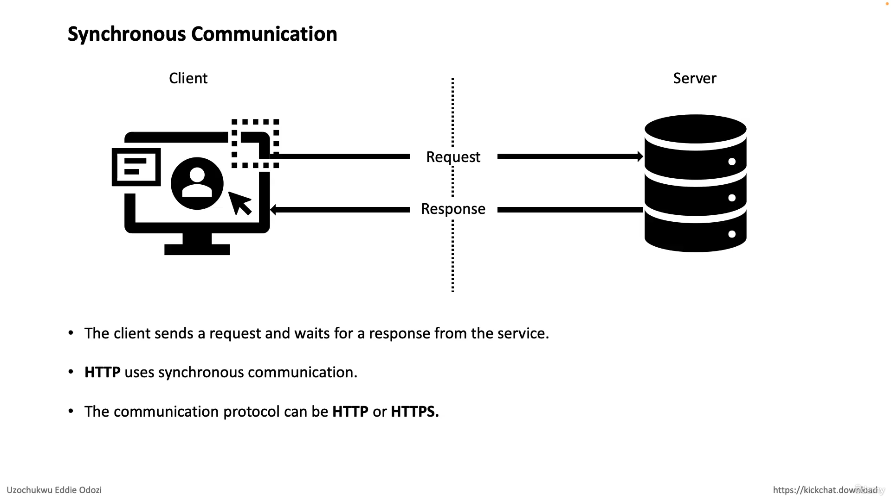
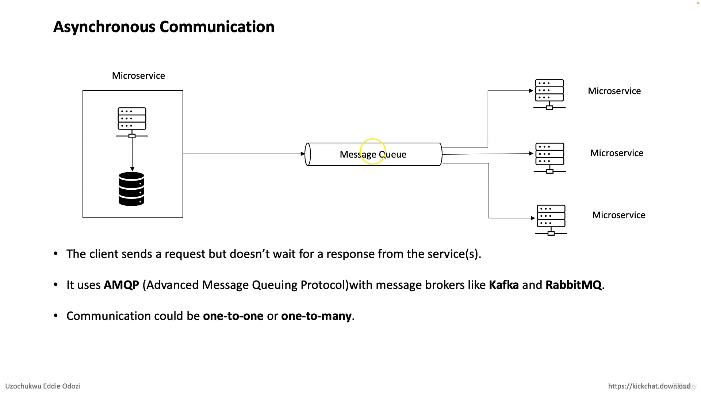

# Microservices communication types : 

## Microservices communicate with each other using various communication types, each suited to different scenarios and requirements. Here are some common communication types:

## synchronous communication 

**HTTP/HTTPS:** Microservices can communicate over the standard HTTP/HTTPS protocols using RESTful APIs. This approach is simple, widely adopted, and suitable for communication between services that are not tightly coupled. It allows for stateless interactions and is ideal for public-facing APIs.

## Asynchronous communication 

 **Messaging Queues:** Microservices can exchange messages through messaging queues like RabbitMQ, Apache Kafka, or Amazon SQS. This asynchronous communication pattern decouples services and ensures reliable message delivery. It's suitable for scenarios where loose coupling and high scalability are required.

**gRPC:** gRPC is a high-performance RPC (Remote Procedure Call) framework developed by Google. It uses protocol buffers for serialization and HTTP/2 for transport, providing efficient communication between microservices. gRPC is particularly useful for performance-critical applications and scenarios where streaming and bidirectional communication are needed.

**GraphQL:** GraphQL is a query language for APIs that enables clients to request only the data they need. It allows microservices to expose a single endpoint for data retrieval, empowering clients to specify their data requirements. GraphQL is beneficial for frontend-driven development and scenarios where clients have diverse data needs.

**Event-Driven Architecture:** Microservices can communicate through events using techniques like Event Sourcing or Domain-Driven Design (DDD). Events represent state changes or significant occurrences within a system and can be published to event streams or bus-like Kafka. Other microservices subscribe to these events and react accordingly. Event-driven architecture promotes loose coupling, scalability, and flexibility.

**WebSockets:** WebSockets enable bidirectional, real-time communication between clients and servers. Microservices can use WebSockets for scenarios requiring persistent connections and real-time updates, such as chat applications or live dashboards.

**Service Mesh:** A service mesh like Istio or Linkerd provides a dedicated infrastructure layer for handling service-to-service communication. It offers features like service discovery, load balancing, traffic management, security, and observability. Service meshes are beneficial for managing complex microservices architectures with a large number of services.

# Each communication type has its advantages and is suitable for different use cases. The choice depends on factors like performance requirements, scalability, reliability, and the specific needs of the application architecture.