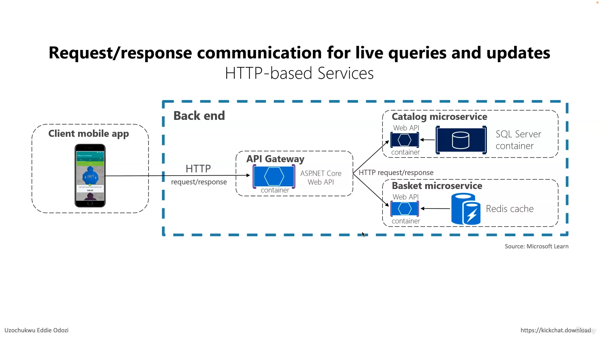
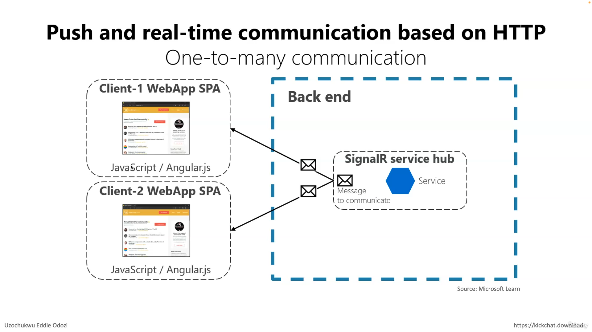
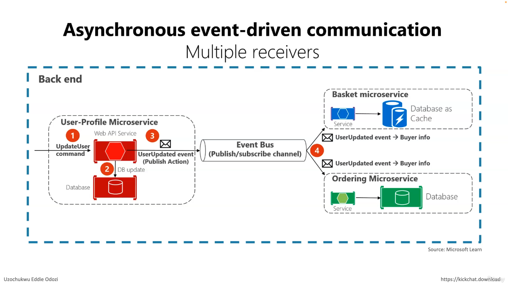

### Microservices architecture typically involves breaking down a large application into smaller, independently deployable services that communicate with each other over a network. There are several communication styles commonly used in microservices architectures:

## request/response communication for live queries and updates 

## push and realtime communication based on http

## Asynchronous-event-driven communication 

1. **HTTP/REST**: This is perhaps the most common communication style for microservices. Services communicate over HTTP using RESTful APIs (Representational State Transfer). Each service exposes a set of endpoints that other services can call to perform actions or retrieve data. REST APIs typically use standard HTTP methods like GET, POST, PUT, DELETE, etc., and data is usually exchanged in JSON or XML format.

2. **Messaging/Message Queues**: In this style, services communicate asynchronously using a messaging system. Services send messages to queues or topics, and other services consume those messages from the queues. This decouples the sender and receiver, allowing for more scalable and resilient architectures. Popular messaging systems used in microservices include RabbitMQ, Apache Kafka, and Amazon SQS.

3. **gRPC**: gRPC is a modern, high-performance RPC (Remote Procedure Call) framework developed by Google. It uses Protocol Buffers (protobuf) as the interface definition language and HTTP/2 as the transport protocol. gRPC enables efficient communication between services with features like streaming, bidirectional communication, and strong typing.

4. **GraphQL**: GraphQL is a query language for APIs that allows clients to request only the data they need. In a microservices architecture, GraphQL can be used as an API gateway or a layer on top of existing services to aggregate and orchestrate data from multiple services. It provides flexibility for clients to specify their data requirements and reduces over-fetching and under-fetching of data.

5. **Event-Driven Architecture (EDA)**: In EDA, services communicate by publishing and subscribing to events. When something of interest happens in one service, it emits an event, and other services subscribe to those events and react accordingly. This style promotes loose coupling between services and enables real-time communication and scalability. Event-driven architectures can be implemented using messaging systems like Kafka or through event streaming platforms.

6. **Database Replication**: In some cases, microservices may communicate indirectly through shared databases. However, this approach can lead to tight coupling between services and can make it harder to scale and evolve the system. It's generally recommended to avoid direct database communication between microservices in favor of more decoupled communication styles.

These communication styles are not mutually exclusive, and a microservices architecture may employ multiple styles depending on the requirements of the system and the preferences of the development team.