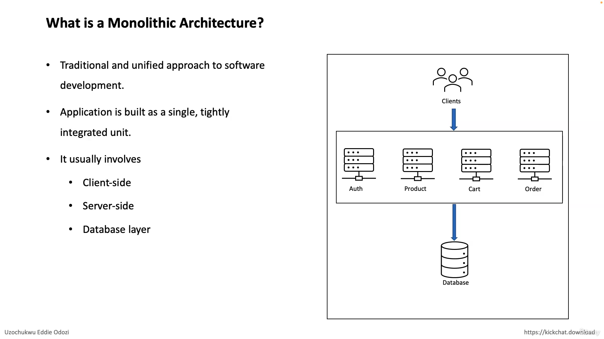

# What is Monolithic Architecture

### Monolithic architecture refers to a traditional software design approach where an entire application is built as a single, indivisible unit. In a monolithic architecture, all components and modules of the application are tightly integrated and run as a single process. This contrasts with other architectural styles, such as microservices or service-oriented architecture (SOA), where an application is composed of loosely coupled, independent services

## Key characteristics of monolithic architecture include:

1. **Single Codebase**: The entire application, including its functionality and features, is implemented within a single codebase.

2. **Tight Integration**: Components and modules within the application are closely interconnected, often sharing the same codebase, libraries, and databases.

3. **Single Deployment Unit**: The entire application is deployed as a single unit. Updates or changes to any part of the application require deploying the entire monolith.

4. **Scalability Challenges**: Scaling a monolithic application can be challenging, as the entire application must be replicated to handle increased load. This can lead to inefficiencies, especially when only specific components need additional resources.

5. **Development and Maintenance**: In a monolithic architecture, development and maintenance may become more complex as the size of the codebase grows. It can be challenging to manage and coordinate changes across different modules.

# What is benefits of Monolithic architecture

### Monolithic architecture, despite its challenges, has certain benefits that make it suitable for certain types of applications and scenarios. Here are some advantages of monolithic architecture:

1. **Simplicity**: Monolithic applications are generally simpler to develop and understand, especially for smaller projects. The entire codebase is contained in a single unit, making it easier for developers to grasp the overall structure and functionality.

2. **Development Speed**: Since all components are closely integrated, it can be faster to develop and deploy a monolithic application compared to more distributed architectures like microservices. This can be advantageous for rapid prototyping or when time-to-market is crucial.

3. **Easier Debugging and Testing**: Debugging and testing can be more straightforward in a monolithic architecture. The entire application is typically tested as a whole, making it easier to identify and fix issues.

Simplified Deployment: Deploying a monolithic application involves deploying a single unit, which can simplify the deployment process. There is no need to coordinate the deployment of multiple independent services.

4. **Resource Efficiency**: In certain cases, a monolithic architecture may be more resource-efficient than a microservices architecture, as there is less overhead associated with managing and communicating between separate services.

5. **Technology Stack Consistency**: Monolithic applications often use a consistent technology stack throughout, as there is a single codebase. This can make it easier to manage dependencies and ensure compatibility across the entire application.

6. **Easier Scaling in Certain Scenarios**: For applications with a relatively stable and predictable load, scaling a monolithic architecture can be straightforward by replicating the entire application. This approach might be suitable for certain types of small to medium-sized applications.

### It's important to note that while monolithic architecture has its advantages, it may not be the best choice for every application, especially as they grow in size and complexity. Many modern applications, particularly large-scale and distributed systems, are designed using alternative architectures like microservices to address scalability, maintainability, and development agility concerns. The choice between monolithic and other architectures depends on the specific requirements and goals of the project.